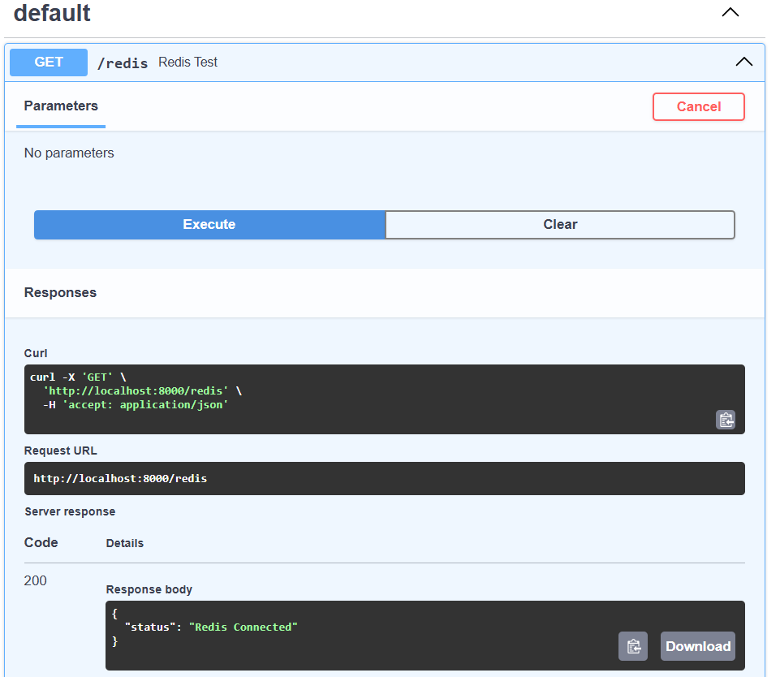

# Task API with PostgreSQL & Docker

A simple CRUD API built with **FastAPI** and **PostgreSQL**, containerized using **Docker Compose**. The project replaces an in-memory task list with a PostgreSQL database while keeping the API endpoints unchanged.

---

## Features

- Create tasks
- Read all tasks
- Read a single task
- Update tasks
- Delete tasks
- PostgreSQL database
- Docker Compose support
- Environment variables using `.env`
- Persistent storage using Docker volumes

### Optional

- Redis container added to Docker Compose
- FastAPI endpoint to verify Redis connectivity

---

## Technologies

- Python
- FastAPI
- PostgreSQL
- psycopg
- Docker
- Docker Compose
- Redis (optional)

---

## Why PostgreSQL?

PostgreSQL was chosen because it is a reliable relational database that stores data permanently. Unlike an in-memory list, data remains available even after restarting the application or Docker containers.

---

## Project Structure

```text
.
├── main.py
├── db.py
├── postgres_repository.py
├── init.sql
├── Dockerfile
├── docker-compose.yml
├── requirements.txt
├── .env.example
├── README.md
└── screenshots
    ├── Screenshot 2026-07-21 163328.png
    ├── Screenshot 2026-07-21 163630.png
    └── redis.png (optional)
```

---

## Database

The PostgreSQL database runs inside a Docker container.

A Docker volume (`pgdata`) stores the database files so that data persists after restarting the application or the database container.

The `init.sql` script automatically creates the required `tasks` table during the first database initialization.

---

## Environment Variables

Create a `.env` file:

```env
DATABASE_URL=postgresql://postgres:devpass@db:5432/tasks
```

A `.env.example` file is included in the repository.

---

## Installation

Clone the repository:

```bash
git clone https://github.com/<your-username>/<repository-name>.git
cd <repository-name>
```

Build and start the application:

```bash
docker compose up --build
```

---

## Swagger UI

Interactive docs are available at `/docs` once the server is running.

Open:

```
http://localhost:8000/docs
```

---

## API Endpoints

| Method | Endpoint | Description |
|---------|----------|-------------|
| GET | `/` | API information |
| GET | `/health` | Health check |
| GET | `/tasks` | Get all tasks |
| GET | `/tasks/{id}` | Get a single task |
| POST | `/tasks` | Create a task |
| PUT | `/tasks/{id}` | Update a task |
| DELETE | `/tasks/{id}` | Delete a task |
| GET | `/redis` | Verify Redis connection *(optional)* |

---

## Persistence

Persistence was verified by:

1. Starting the application with Docker Compose.
2. Creating tasks through the API.
3. Stopping the containers.
4. Running `docker compose up` again.
5. Confirming that the previously created tasks were still present.

The PostgreSQL database persists because it uses the `pgdata` Docker volume.

---

## Architecture

The API routes remained unchanged when switching from an in-memory list to PostgreSQL.

Only the data access layer (`postgres_repository.py`) was replaced, demonstrating separation between the API layer and the storage layer.

---

## Docker Commands

Start the application:

```bash
docker compose up --build
```

Stop the application:

```bash
docker compose down
```

---

## Screenshots

### Swagger UI - All Endpoints


### Swagger UI - Create Task


### Redis Connection (Optional)



---

## Optional: Redis

Redis was added to the Docker Compose stack as an optional in-memory cache service.

A `/redis` endpoint was implemented to verify communication between the FastAPI application and the Redis container using the Redis `PING` command.

Example response:

```json
{
  "status": "Redis Connected"
}
```

---

## Future Improvements

- Cache frequently accessed data with Redis
- User authentication and authorization
- Search and filtering
- Pagination
- Database indexing
- Automated testing
- CI/CD pipeline