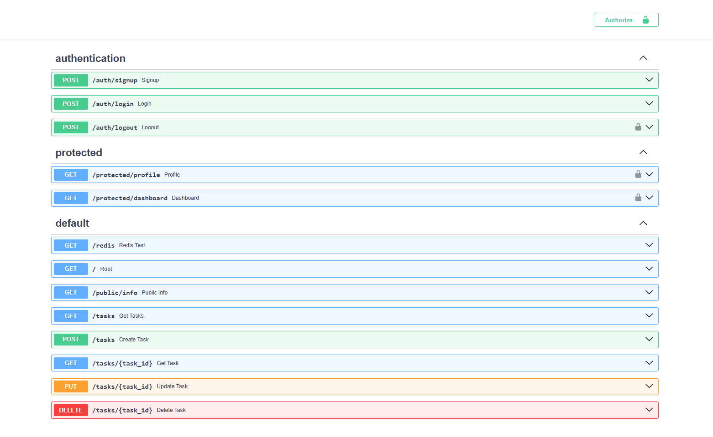

# Task API with FastAPI, PostgreSQL, Docker & Supabase Authentication

A RESTful Task Management API built with **FastAPI**, **PostgreSQL**, **Supabase Authentication**, and **Docker**. The project provides task CRUD operations, JWT-based authentication, protected endpoints, PostgreSQL persistence, Redis connectivity verification, and interactive API documentation through Swagger UI.

---

## Features

* User Sign Up
* User Login
* User Logout
* JWT authentication using Supabase Auth
* Protected API endpoints
* Public API endpoint
* Create tasks
* Retrieve all tasks
* Retrieve a single task
* Update tasks
* Delete tasks
* PostgreSQL database integration
* Persistent PostgreSQL storage using Docker volumes
* Docker Compose support
* Environment variable configuration
* Swagger UI API documentation
* Redis connectivity check

---

## Technologies Used

* **Python 3**
* **FastAPI**
* **PostgreSQL**
* **Supabase Auth**
* **Psycopg2**
* **Pydantic**
* **Docker**
* **Docker Compose**
* **Redis**

---

## Project Structure

```text
.
├── main.py
├── auth.py
├── protected.py
├── middleware_client.py
├── supabase_client.py
├── postgres_repository.py
├── db.py
├── init.sql
├── docker-compose.yml
├── Dockerfile
├── requirements.txt
├── .env.example
├── .gitignore
├── README.md
└── screenshots
    └── swagger-menu.png
```

---

## Authentication

Authentication is handled by **Supabase Auth**.

The authentication flow is:

1. A user registers with an email and password.
2. Supabase Auth processes the registration.
3. The user logs in using their credentials.
4. Supabase returns an access token (JWT).
5. The client sends the JWT with protected requests.
6. The API validates the token through Supabase Auth.
7. Valid users are allowed to access protected endpoints.

Protected requests use the following authorization header:

```text
Authorization: Bearer <access_token>
```

The `get_current_user` dependency is used to validate the access token and retrieve the authenticated user.

---

## Database

Task data is stored in **PostgreSQL** running inside a Docker container.

The database schema is initialized using `init.sql`.

A Docker volume is used for PostgreSQL data persistence, allowing task data to remain available after containers are stopped and restarted.

Authentication data is managed separately through Supabase Auth.

---

## Environment Variables

Create a `.env` file in the project root:

```env
DATABASE_URL=postgresql://postgres:your_password@db:5432/tasks

SUPABASE_URL=https://your-project-id.supabase.co
SUPABASE_KEY=your_publishable_key
```

A `.env.example` file is included in the repository.

**Do not commit `.env` or any Supabase credentials to the repository.**

---

## Installation

Clone the repository:

```bash
git clone https://github.com/<your-username>/<repository-name>.git
cd <repository-name>
```

Install the Python dependencies if running the application outside Docker:

```bash
pip install -r requirements.txt
```

For the Docker-based setup, dependencies are installed when the application image is built.

---

## Running with Docker

Build and start all services:

```bash
docker compose up --build
```

The API will be available at:

```text
http://localhost:8000
```

To stop the services:

```bash
docker compose down
```

To rebuild and recreate the containers:

```bash
docker compose up --build --force-recreate
```

---

## Swagger UI

FastAPI automatically generates interactive API documentation.

Open:

```text
http://localhost:8000/docs
```

The Swagger UI provides access to all available API endpoints.

For protected endpoints, use the **Authorize** button and provide the JWT access token returned by the login endpoint.

### Swagger UI



---

## API Endpoints

### Authentication

| Method | Endpoint       | Authentication | Description                               |
| ------ | -------------- | -------------- | ----------------------------------------- |
| POST   | `/auth/signup` | No             | Register a new user                       |
| POST   | `/auth/login`  | No             | Authenticate a user and return JWT tokens |
| POST   | `/auth/logout` | Yes            | Log out the authenticated user            |

### Public

| Method | Endpoint       | Authentication | Description               |
| ------ | -------------- | -------------- | ------------------------- |
| GET    | `/public/info` | No             | Access public information |

### Protected

| Method | Endpoint               | Authentication | Description                               |
| ------ | ---------------------- | -------------- | ----------------------------------------- |
| GET    | `/protected/profile`   | Yes            | Retrieve the authenticated user's profile |
| GET    | `/protected/dashboard` | Yes            | Access the protected dashboard            |

### Tasks

| Method | Endpoint      | Authentication | Description             |
| ------ | ------------- | -------------- | ----------------------- |
| GET    | `/tasks`      | No             | Retrieve all tasks      |
| GET    | `/tasks/{id}` | No             | Retrieve a task by ID   |
| POST   | `/tasks`      | No             | Create a new task       |
| PUT    | `/tasks/{id}` | No             | Update an existing task |
| DELETE | `/tasks/{id}` | No             | Delete a task           |

### Utility

| Method | Endpoint  | Description                     |
| ------ | --------- | -------------------------       |
| GET    | `/`       | Return API information          |
| GET    | `/health` | Return the API health status    |
| GET    | `/redis`  | Verify Redis connectivity       |

---

## HTTP Status Codes

| Status Code | Description                                          |
| ----------- | ---------------------------------------------------- |
| 200         | Request successful                                   |
| 201         | Resource created successfully                        |
| 204         | Request successful with no response body             |
| 400         | Bad request                                          |
| 401         | Authentication required or credentials/token invalid |
| 404         | Requested resource not found                         |

---

## Redis

Redis is included in the Docker Compose environment.

The `/redis` endpoint verifies connectivity between the FastAPI application and the Redis container by sending a `PING` command.

A successful response is:

```json
{
    "status": "Redis Connected"
}
```

---

## Architecture

The application separates the API layer from the database access layer.

```text
Client
  │
  ▼
FastAPI
  │
  ├── Authentication ──► Supabase Auth
  │
  ├── Protected Routes
  │
  └── Task Routes
          │
          ▼
   PostgreSQL Repository
          │
          ▼
      PostgreSQL
```

Redis runs as a separate service and is accessed by the FastAPI application through the Docker Compose network.

---

## Future Improvements

* Role-Based Access Control (RBAC)
* OAuth authentication
* Password reset functionality
* Email verification
* Refresh token rotation
* Pagination
* Search and filtering
* Automated testing
* CI/CD pipeline
* Rate limiting

---

## License

This project was developed for educational purposes as part of the **FlyRank Backend Internship**.
